# Project Relationship and Goal Status

This document maps how components connect (with file locations) and evaluates current state against the project end goals.

## 1) End-to-End Relationship Map

```mermaid
flowchart TD
    U["Web UI/API\n`src/ui/app.py`"] --> C["App Context / Lifecycle\n`src/ui/context.py`"]
    C --> CAP["Camera Capture\n`src/capture/realsense.py`"]
    C --> DET["Face Detection (BlazeFace)\n`src/detection/blazeface.py`"]
    C --> VP["Vision Pipeline\n`src/ui/pipeline.py`"]
    C --> SYS["FaceRecognitionSystem\n`src/system.py`"]
    C --> PREF["UI Preferences\n`src/ui/preferences.py`"]

    VP --> ALN["Alignment\n`src/alignment/align.py`"]
    VP --> EMB["Embedding (MobileFaceNet)\n`src/embedding/mobilefacenet.py`"]

    SYS --> PROTO["Strategy Interfaces\n`src/protocols.py`"]
    SYS --> CLS["Classifier Head (CosineLinear)\n`src/continual/classifier.py`"]
    SYS --> EXS["Exemplar Store\n`src/memory/exemplar_store.py`"]
    SYS --> GAS["Gaussian Store\n`src/memory/gaussian_store.py`"]
    SYS --> LOGS["Workspace Logs\n`workspace/logs/registration.log`"]
    SYS --> CKPT["Checkpoint State\n`workspace/checkpoints/classifier.pt`\n`workspace/system_state.json`"]

    PROTO --> REG["Registration Strategies"]
    PROTO --> SEL["Exemplar Selectors"]
    PROTO --> REC["Recognition Strategies"]

    REG --> NAIVE["Naive FT\n`src/continual/naive_ft.py`"]
    REG --> REPLAY["Exemplar Replay\n`src/continual/exemplar_replay.py`"]
    REG --> LWF["LwF (no replay)\n`src/continual/lwf.py`"]
    REG --> RLWF["Replay + LwF\n`src/continual/replay_lwf.py`"]
    REG --> SYN["Synthetic Replay\n`src/continual/synthetic_replay.py`"]

    SEL --> HERD["Herding\n`src/memory/herding.py`"]
    SEL --> RAND["Random\n`src/memory/random_selector.py`"]

    REC --> NCM["NCM Recognizer\n`src/recognition/ncm.py`"]
    REC --> CLFREC["Classifier Recognizer\n`src/recognition/classifier_based.py`"]

    EXP["Offline Experiment Entrypoints\n`experiments/*/run.py`"] --> EH["Embedding + Eval Utilities\n`experiments/embedding_helper.py`\n`experiments/eval_utils.py`\n`experiments/experiment_logging.py`"]
    EXP --> SYS
    EXP --> MM["Memory Metrics Helper\n`experiments/memory_metrics.py`"]

    DATA["Task Split Definition\n`data/supertask_8_2.json`"] --> EXP

    TESTS["Tests\n`tests/test_*.py`"] --> SYS
    TESTS --> VP
    TESTS --> DET
    TESTS --> EMB
    TESTS --> EXS
    TESTS --> GAS
    TESTS --> REG
```



## 2) Runtime Data Flow

1. `src/ui/app.py` streams frames from `RealSenseCapture`, runs `BlazeFaceDetector`, and uses `VisionPipeline` for detect -> align -> embed.
2. For recognition mode, each primary face embedding is passed to `FaceRecognitionSystem.recognize()`.
3. `FaceRecognitionSystem` delegates to a `RecognitionStrategy` (`NCMRecognizer` or `ClassifierRecognizer`).
4. For registration mode, capture helpers collect embeddings across center/left/right poses, then call `FaceRecognitionSystem.register()`.
5. `register()` routes to selected `RegistrationStrategy` (naive/replay/LwF/synthetic), updates memory stores, and persists workspace state.

## 3) Where Each Goal Is Reflected in Code

| End Goal | Current Implementation Evidence | Status |
|---|---|---|
| Incremental learning workflow | Registration API + multi-pose capture + `system.register()` orchestration | Implemented |
| >=2 anti-forgetting techniques | Exemplar replay, LwF, synthetic replay (+ naive baseline) | Implemented |
| Memory-efficient strategy comparison | Exemplar and Gaussian stores + experiment scripts + memory metrics helper | Partially implemented (framework ready) |
| Support >=10 people, <1 min/update | Config/training loops exist; no committed benchmark report artifacts | Not yet evidenced |
| >95% old-identity retention | Methods and tests exist; no committed final retention results | Not yet evidenced |
| <=8 GB on RPi5 | Memory instrumentation (`/status`, `memory_metrics.py`) exists; no committed RPi report | Not yet evidenced |
| RPi deployment + RealSense use | RealSense capture + BlazeFace + MobileFaceNet integration present | Partially evidenced (implementation present) |
| Dataset incremental protocol + reporting | `data/supertask_8_2.json` + experiment runners exist | Partially implemented (needs result artifacts) |
| Working UI demo (register 5 add 3 verify 8) | FastAPI UI, video stream, register/remove/settings/status endpoints implemented | Implemented in software; demo evidence pending |

## 4) Validation Snapshot (Current Repo)

- Non-integration tests: `35 passed`, `2 failed`, `4 deselected`.
- Failing tests are in `tests/test_system.py` and indicate expectation drift:
  - Synthetic replay test expects Gaussian `n_samples == exemplar_k`, but implementation now fits Gaussian on all embeddings.
  - Replay test still expects a `NotImplementedError`, but replay is implemented.
- Interpretation: core implementation is mostly in place, but test/docs are partially outdated relative to newer feature behavior.

## 5) Practical Next Milestones to Reach End Goals

1. Align tests/docs with current strategy behavior (especially replay + synthetic replay semantics).
2. Run and save benchmark artifacts for `baseline_classifier`, `baseline_ncm`, `lwf_classifier`, `replay_classifier`, `synthetic_replay_classifier`.
3. Produce a consolidated results table for:
   - accuracy/forgetting
   - training time per added identity
   - memory usage (RSS + store sizes)
4. Execute and record the required on-device scenario (5 initial + 3 incremental).

## 6) Previous Local Supertask Experiment Pass (Superseded For Final Metrics)

Environment:
- Python: `.venv311` (`Python 3.11.3`)
- Previous desktop-only vision stack used before the Raspberry Pi 5-only cleanup. These results are retained as historical method-comparison notes only and are not final deployment metrics.
- Smoke test: one image from `data/val/n000001/0001_01.jpg` successfully produced one `(1, 128)` MobileFaceNet embedding.
- Supertask data check: `data/supertask_8_2.json` contains 10 identities across 5 tasks; all referenced train/test image paths exist locally.

Commands run:

```bash
.venv311/bin/python -m experiments.baseline_ncm.run --reset-workspace
.venv311/bin/python -m experiments.baseline_classifier.run --reset-workspace --confidence-threshold 0.1
.venv311/bin/python -m experiments.replay_classifier.run --reset-workspace --confidence-threshold 0.1
.venv311/bin/python -m experiments.lwf_classifier.run --reset-workspace --confidence-threshold 0.1
.venv311/bin/python -m experiments.synthetic_replay_classifier.run --reset-workspace --confidence-threshold 0.1
```

Results:

| Method | Final avg accuracy | Avg forgetting | BWT | Peak RSS | Log |
|---|---:|---:|---:|---:|---|
| `baseline_ncm` | 0.9600 | 0.0100 | -0.0125 | 683.55 MB | `experiments/baseline_ncm/logs/evaluation.log` |
| `baseline_classifier` | 0.3425 | 0.3433 | -0.4292 | 677.88 MB | `experiments/baseline_classifier/logs/evaluation.log` |
| `replay_classifier` | 0.9800 | 0.0100 | 0.0000 | 715.70 MB | `experiments/replay_classifier/logs/evaluation.log` |
| `lwf_classifier` | 0.2100 | 0.4200 | -0.5250 | 672.97 MB | `experiments/lwf_classifier/logs/evaluation.log` |
| `synthetic_replay_classifier` | 0.9900 | 0.0100 | -0.0125 | 713.48 MB | `experiments/synthetic_replay_classifier/logs/evaluation.log` |

Interpretation:
- Exemplar replay and synthetic replay are the best classifier-based results in this pass.
- NCM remains a strong non-training baseline for this 10-person supertask.
- Naive classifier and no-replay LwF show clear forgetting/instability under this protocol.
- These results are useful for method comparison only. Final time and memory numbers must come from Raspberry Pi 5 runs.

Runner changes made during this pass:
- `experiments/replay_classifier/run.py` and `experiments/lwf_classifier/run.py` now support the same clean-run CLI shape as the other runners and retain their workspaces.
- `experiments/synthetic_replay_classifier/run.py` now logs peak RSS memory snapshots and retained workspace path.

Pi / RealSense compatibility notes:
- Offline experiments should now be renewed on Raspberry Pi 5 with `PYTHONPATH=. python experiments/run_all_pi_experiments.py`.
- The UI/capture path requires RealSense on Raspberry Pi via `pyrealsense2`; there is no OpenCV webcam fallback.
- On Pi/aarch64, `pyrealsense2` is not expected to install from the normal PyPI wheel path; it should be built/installed from Librealsense as noted in `requirements.txt`.

Verification:
- Python compile check passed for changed experiment/UI Python files.
- Focused non-integration tests passed: `37 passed, 4 deselected`.
- FastAPI route registration check passed for `/video_feed`, `/pipeline/status`, and `/pipeline/aligned_face.jpg`.
- Full selected test run initially showed one MediaPipe integration failure: `tests/test_detection.py::test_positive_fixture_images_have_face_detections` did not detect a face in `pos1.png` with the old desktop MediaPipe stack. Pi RealSense validation remains a separate hardware step.

